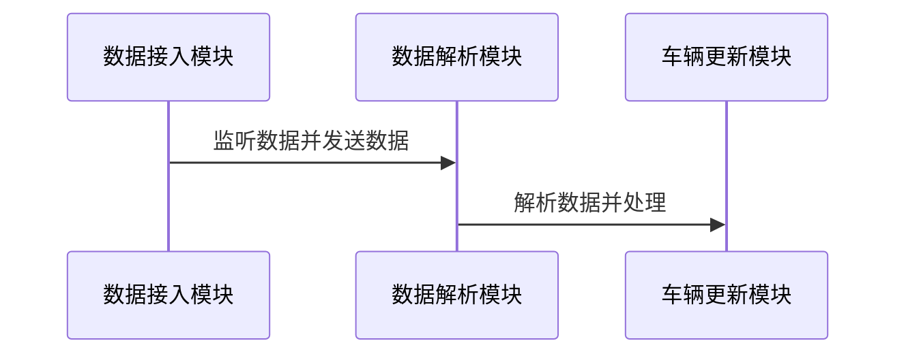
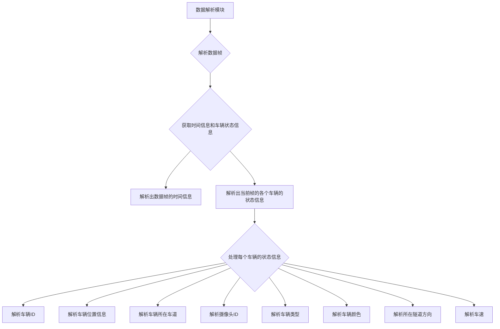
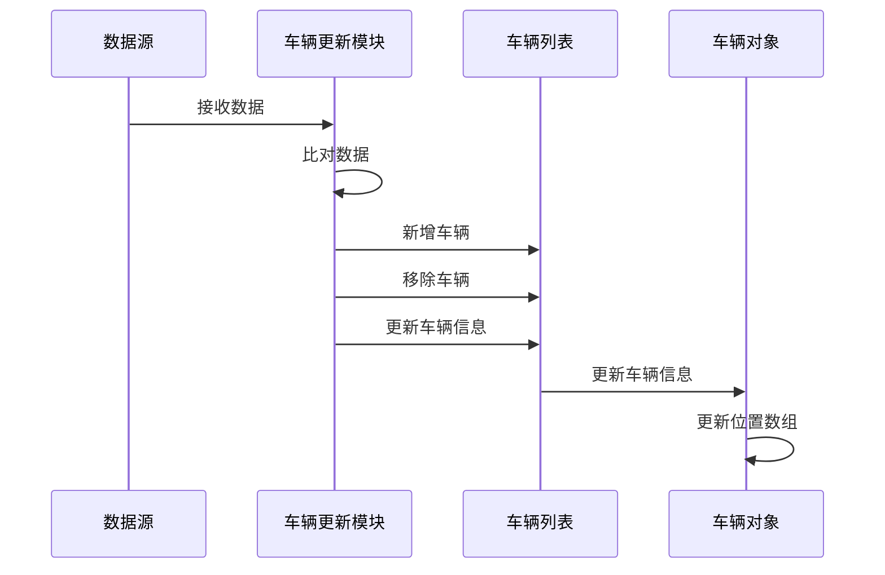
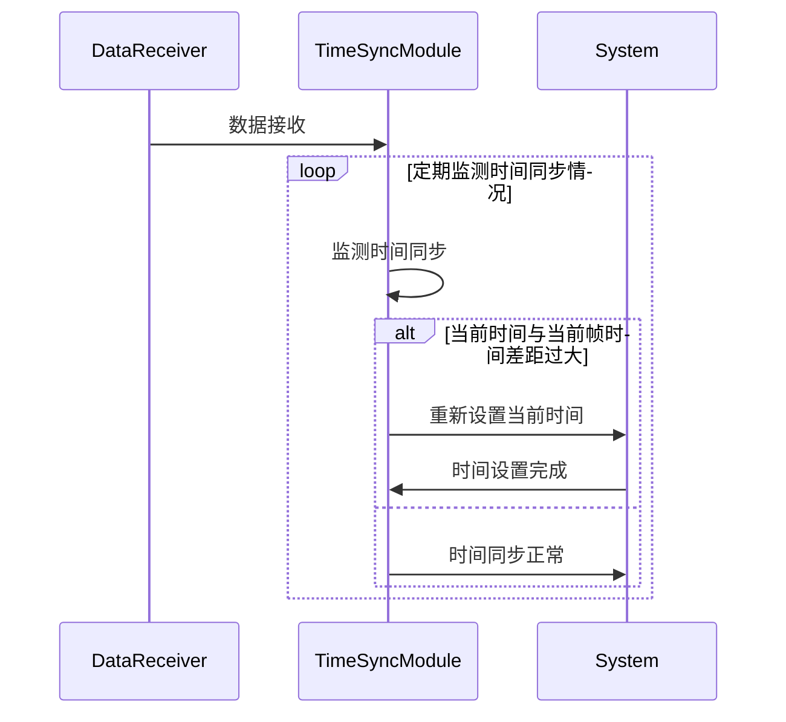

# 隧道车辆实时展示算法设计专利说明书

## 1. 技术领域

`在此处简要描述专利所涉及的技术领域。`

## 2. 背景技术

`在此处介绍与该专利相关的背景技术和现有解决方案的问题或不足之处。`

隧道交通管理和安全监控是城市交通系统的重要组成部分。传统的隧道交通监控系统通常通过摄像头和传感器获取车辆信息。然而，随着交通流量的增加，实时展示和监测隧道车辆的重要性日益凸显。此外，历史数据的回放功能也是一个重要需求。然而，现有系统在处理和展示车辆状态及位置方面存在以下问题：

1. 实时性：传统系统的展示界面通常无法提供实时信息更新，影响监控人员及时获取最新的交通状态和事件信息，进而影响其做出及时决策和采取相应行动的能力。
2. 可视化表达：传统系统的展示方式相对简单，仅能提供基本的车辆位置和状态信息。这种简单表达方式无法全面传达复杂的交通情况，使监控人员难以充分理解和评估交通状况。
3. 数据过载：在大规模交通监控系统中，传感器和摄像头等设备采集到的数据量巨大。传统展示界面可能无法有效处理和展示这些海量数据，导致监控人员难以快速获取所需信息，甚至可能遗漏关键信息。
4. 数据关联：传统系统可能未能充分关联不同数据源之间的信息。例如，车辆位置数据可能无法与实时交通事件数据关联，限制了监控人员准确理解交通事件对车辆流动的影响。
5. 用户友好性：传统展示界面缺乏用户友好性，难以直观地呈现交通信息和相关指标。监控人员可能需花费较多时间和精力来解读和理解展示界面上的信息，影响工作效率和决策质量。

为解决这些问题，现代的隧道交通管理和安全监控系统采用先进的可视化技术和用户界面设计，如实时地图显示、可定制的信息图表和可视化报警提示等。这些改进旨在提供更准确、全面和易于理解的交通信息展示效果，帮助监控人员更快速、准确地了解交通状况，并做出相应的决策和应对措施。

## 3. 发明内容

`在此处描述该专利的发明内容、创新点和解决的技术问题。`

本专利提供了一种针对隧道车辆实时展示的算法设计，解决了现有解决方案中存在的问题。算法主要包括数据的接入方式、车辆实时运行状态信息的更新方法和车辆位置的更新算法。

首先，该算法设计了灵活的数据接入方式，包括实时数据接入和历史回放数据接入。这使得系统能够同时支持实时数据和历史数据的接入，以满足不同应用场景的需求。

其次，为了解决时间同步问题，该算法引入了时间同步模块，定期监测时间同步情况并纠正时间系统偏移，以确保数据的准确性和连续性。

针对车辆位置的更新和计算，该算法设计了车辆更新模块和车辆位置计算方法。车辆更新模块通过对比新接收到的数据和上次保存的数据，更新已存在的车辆对象的信息，并根据车辆的ID判断是否有新增或减少的车辆。车辆位置计算方法利用插值算法，在给定时刻下估算车辆的位置，将车辆的位置信息存储在位置数组中，并根据系统当前的时间进行位置的插值计算，实时更新车辆的位置信息。

综上所述，本算法提供了一种创新的解决方案，能够实现隧道车辆的实时展示，并有效地解决了传统系统中存在的问题。
### 系统模块组成
这个系统包括三个模块：数据接入、数据解析和车辆更新。 数据接入模块实时监听外部数据源，一旦有新数据到来就进行解析，并将解析完毕的数据传递给车辆更新模块。车辆更新模块接收到数据后，完成对数据的处理。通过这样的方式，整个系统实现了一个完整的流程，确保车辆的数据能够及时得到更新和处理。

#### 数据接入模块

数据接入模块可接入实时数据和历史数据，实时数据通过socket连接，实时将数据传入数据接入模块。为了保证数据的连续性，一般每秒钟接入4帧数据，数据频率过高会导致系统数据处理不过来造成卡顿和延迟。

数据接入模块可以同时接收多帧数据，每帧数据包含了当前帧数据的时间，一般为数据的打包时间，以及当前帧时间下，每辆车的位置信息、车道、车速、车辆的颜色、类型等属性信息。

#### 数据解析模块
数据解析模块将数据接入模块传入的数据解析成数据帧，针对每个数据帧，解析出数据帧的时间信息，以及当前帧的各个车辆的状态信息，具体包括：车辆ID、车辆位置（x,y坐标)、所在车道、摄像头ID、车辆类型、车辆颜色、所在隧道方向、车速。

##### 接入实时数据
数据包含当前帧的时间，以及所有车辆当前时刻的位置；
位置的定义为车辆在隧道中，从入口到当前位置的距离；沿着车道的距离；
还包含了偏移的距离，距离道路中心线；包含了车辆所在的车道；车的速度以及其他的一些属性信息；

##### 接入历史数据

**实时接入数据的处理**；

实时数据可能是历史数据可能是实时数据

开始进行播放时，需要设置当前时间
1. 历史数据：在进行历史回访时，以第一帧数据的时间作为事件播放的开始时间；
2. 实时数据：以当前时间作为系统时间；
#### 时间同步模块
##### 数据不同步问题
为解决实时车流数据的时间同步问题，需要考虑以下因素：

1. **时间系统误差**：不同计算机时间系统存在时钟偏差，导致每秒钟定义的时长存在误差。类似于有些钟走得快，有些钟走得慢，可能会导致一小时差5分钟的情况。

2. **计算延迟误差**：在处理帧数据时，计算机会存在一定的处理延迟。例如，以程序开始执行的时刻作为当前帧的时间，但在处理数据时需要花费一定时间，导致实际数据发出的时间延后于标记的时间。

以上两种情况都会导致数据帧中的时间间隔与实际情况不符，进而影响到系统的播放流程。例如，在一个10秒钟的时间段内，平均每秒钟收到了4帧数据，总共约40帧数据。但是，第一帧数据可能对应开始时间，而最后一帧数据可能记录的时间是第9秒，导致在第10秒时没有车辆的位置信息，导致车辆停止运动。
##### 解决方法
为解决这些问题，可以采取以下措施：

- **定期监测时间同步情况**：系统定期检测当前时间与当前帧时间的差距。如果差距过大，可以重新设置当前时间，以保证车辆数据的流畅运行。

- **同步时间系统**：通过使用网络时间协议（NTP）等时间同步机制，将系统内部的时间与外部数据源的时间进行同步，减小时间系统误差。

- **考虑数据处理延迟**：在数据处理过程中，合理考虑计算机的处理延迟，确保数据的发出时间与标记的时间相符。

通过以上实施措施，可以有效解决实时车流数据的时间同步问题，保证系统能够正常播放和展示车辆的位置信息，避免车辆停止运动等异常情况的发生。

#### 车辆更新模块：

车辆更新模块逻辑如下：

1. 当收到数据时，数据包含了当前时间下所有车辆的信息，包括每辆车的id、位置（x,y坐标)、摄像头id、车辆类型、颜色、车道、所在隧道和车速。

2. 模块会将接收到的数据与上次保存的数据进行比对，通过车辆的id判断是否有新增或减少的车辆。对于新增的车辆，模块会创建新的车辆对象并添加到车辆列表中；对于减少的车辆，模块会从车辆列表中移除相应车辆。

3. 对于每次接收到的数据，模块会遍历其中的所有车辆。通过车辆的id，更新已存在的车辆对象的信息，包括位置（x,y坐标)、摄像头id、车辆类型、颜色、车道、所在隧道和车速。同时，模块会更新每个车辆的位置数组，该数组记录了车辆在每个时刻的位置信息。

##### 车辆位置计算

在数据更新的过程中，每辆车会记录每次收到数据的时间信息和该时间下的位置坐标，存到一个位置数组中，在计算车辆位置时，会根据系统当前的时间，通过插值算法，如线性插值算法（但不限于线性插值），插值出当前时间的车辆位置。遍历所有车辆，计算出当前时刻所有车辆的位置，并对车辆的位置进行更新。

**位置定义：** 我们使用车辆相对于隧道入口的行驶距离（沿着车道的距离）作为车辆位置的计算基础，并记录车辆相对道路中心线的偏移距离。在时刻 $t$，车辆的位置坐标被定义为 $(x, y)$，其中 $x$ 表示车辆相对于隧道入口的行驶距离，隧道入口位置被设为坐标原点（0 坐标点），而 $y$ 表示车辆相对于道路中心线的偏移距离，左侧为负值，右侧为正值。因此，隧道的左洞和右洞使用各自独立的坐标系。

假设车辆位置信息存储在数组 $V = [(t_1, x_1, y_1), (t_2, x_2, y_2), ..., (t_n, x_n, y_n)]$ 中，其中 $(t_i, x_i, y_i)$ 表示时间 $t_i$ 时的位置坐标 $(x_i, y_i)$。

为了计算车辆在给定时刻 $t$ 的坐标 $(x, y)$，我们使用插值算法，如线性插值或其他插值方法。假设给定时刻 $t$ 位于时间区间 $(t_i, t_{i+1})$，我们可以使用插值公式计算车辆坐标：

$$
x = x_i + (x_{i+1} - x_i) * (t - t_i) / (t_{i+1} - t_i)
y = y_i + (y_{i+1} - y_i) * (t - t_i) / (t_{i+1} - t_i)
$$

这个公式利用了给定时刻 $t$ 在时间区间 $(t_i, t_{i+1})$ 内的相对位置来估算车辆坐标 $(x, y)$。通过对时间和坐标进行线性插值，我们可以近似计算出车辆在任意时刻的位置。

请注意，以上公式仅以线性插值为例，实际应用中可能采用其他插值算法。

## 4. 实施方式

`在此处提供实施该专利的具体方式和方法。`

本发明的算法和系统可通过以下实施方式来进行应用和实现：

1.  **系统部署和配置**：根据实际应用场景的需求，将系统部署在相应的服务器或计算设备上，并进行必要的配置和参数设置。
1.  **数据接入设置**：针对实时数据和历史数据的接入，设置相应的数据源和接口。对于实时数据接入，建立合适的数据通道或使用socket连接进行数据传输；对于历史数据接入，设置数据回放功能或导入历史数据文件。
1.  **时间同步功能实现**：实现时间同步功能，确保系统内部的时间与外部数据源的时间保持一致。可以采用网络时间协议（NTP）或其他时间同步机制来实现时间的准确同步。
1.  **车辆状态展示界面设计**：设计和开发车辆状态展示界面，以实时展示车辆的位置、颜色、车速等信息。界面可以采用图表、地图或其他可视化方式呈现。
1.  **隧道运行状态监测设置**：根据系统需求，设计和实现隧道运行状态监测功能。通过对车辆位置信息、颜色和车速的准确还原，结合隧道的布局和规则，实现对隧道运行状态的准确监测和分析。
1.  **安全管理功能集成**：根据实际需求，将安全管理功能集成到系统中。例如，设置报警机制、异常事件检测和处理等功能，以提供全面的安全管理支持。
1.  **系统测试和优化**：对实施的系统进行全面的测试和调优。确保系统的稳定性、准确性和高效性，并根据测试结果进行必要的优化和改进。

在实施过程中，可以根据具体需求和技术条件进行适当的调整和改进。同时，合理的文档记录和培训可以帮助系统的顺利部署和应用。

### 示意图

`插入相关示意图或图表以更好地说明实施方式。`
#### 系统模块组成

#### 数据解析流程

#### 车辆更新流程
车辆更新模块的逻辑流程。

### 时间同步流程

## 5. 优点效果

`在此处说明实施该专利的优点、技术效果或创新之处。`

这种隧道车辆实时展示算法设计具有以下优点、技术效果和创新之处：
-   实时数据和历史数据接入：系统支持实时数据和历史数据的接入，满足不同应用场景的需求。
-   时间同步功能：通过时间同步功能，纠正时间系统偏移，确保数据的准确性和连续性。
-   实时展示车辆运行状态：系统能够实时展示车辆的位置、颜色、车速等信息，便于监测车辆的运行状态。
-   监测隧道运行状态：系统能够准确监测隧道的运行状态，为安全管理提供支持和参考。

## 6. 具体实施例

`在此处给出一些具体的实施例，以便更好地理解专利的实施方式和效果。`

## 7. 实施例的变形和修改

`在此处描述对该专利实施例的变形、修改或改进。`

本发明的具体实施例可以根据实际需求进行调整和改进。

## 8. 结论

`在此处总结该专利的优点、技术效果和实施方式。`

本发明提供了一种有效处理实时和历史数据、更新车辆状态和位置信息的算法和系统，能够可靠地接入实时数据和历史数据。通过时间同步功能，可以纠正时间系统偏移，确保数据的准确性。该系统能够实时展示车辆的运行状态，监测隧道的运行情况，为安全管理提供便利。同时，系统还能准确还原车辆的位置信息、颜色和车速，以准确监测隧道的运行状态。

该算法和系统具有以下优势和应用：

-   提升安全管理：通过实时展示车辆运行状态和准确监测隧道运行状态，为安全管理提供准确的数据支持。
-   优化运行效率：准确还原车辆的位置信息、颜色和车速，帮助优化隧道的运行效率。
-   应用广泛：该算法和系统可应用于交通管理、隧道监控、智能交通系统等领域，具有广泛的应用前景。

## 9. 引用文献

`列出与该专利相关的引用文献。`

