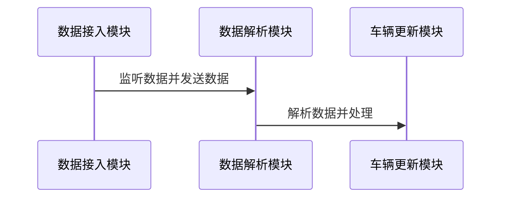
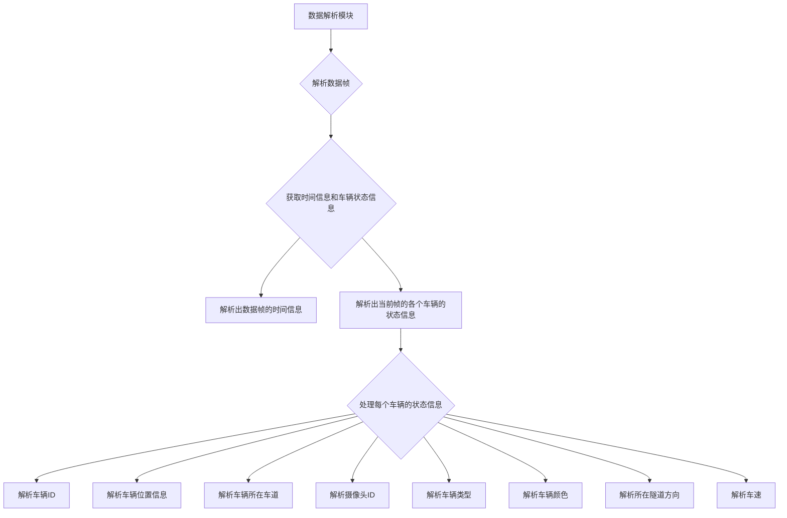
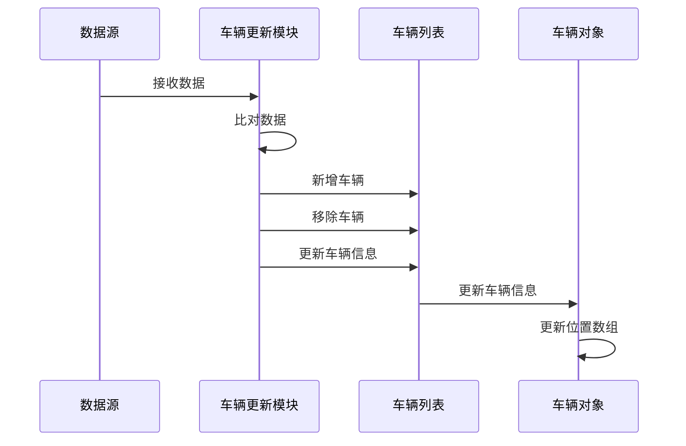

# 隧道车辆运行状态实时展示算法设计
## 背景
## 目的
## 内容
算法内容包括：
- 算法主要设计了，根据定义的数据格式，设计了数据的接入方式，包含实时数据接入，历史回放数据接入。
- 设计了车辆实时运行状态信息的更新方法，利用实时接入的数据不断更新车辆的状态信息。
- 设计了车辆位置的更新算法，通过设置开始时间，实时对车辆数据的位置信息进行插值计算，并通过系统接口更新车辆位置。
## 系统模块组成
这个系统包括三个模块：数据接入、数据解析和车辆更新。 数据接入模块实时监听外部数据源，一旦有新数据到来就进行解析，并将解析完毕的数据传递给车辆更新模块。车辆更新模块接收到数据后，完成对数据的处理。通过这样的方式，整个系统实现了一个完整的流程，确保车辆的数据能够及时得到更新和处理。


### 数据接入模块
<p>数据接入模块可接入实时数据和历史数据，实时数据通过socket连接，实时将数据传入数据接入模块。为了保证数据的连续性，一般每秒钟接入4帧数据，数据频率过高会导致系统数据处理不过来造成卡顿和延迟。</p>
数据接入模块可以同时接收多帧数据，每帧数据包含了当前帧数据的时间，一般为数据的打包时间，以及当前帧时间下，每辆车的位置信息、车道、车速、车辆的颜色、类型等属性信息。

### 数据解析模块
数据解析模块将数据接入模块传入的数据解析成数据帧，针对每个数据帧，解析出数据帧的时间信息，以及当前帧的各个车辆的状态信息，具体包括：车辆ID、车辆位置（x,y坐标)、所在车道、摄像头ID、车辆类型、车辆颜色、所在隧道方向、车速。

#### 接入实时数据
数据包含当前帧的时间，以及所有车辆当前时刻的位置；
位置的定义为车辆在隧道中，从入口到当前位置的距离；沿着车道的距离；
还包含了偏移的距离，距离道路中心线；包含了车辆所在的车道；车的速度以及其他的一些属性信息；


#### 接入历史数据

**实时接入数据的处理**；

实时数据可能是历史数据可能是实时数据

开始进行播放时，需要设置当前时间
1. 历史数据：在进行历史回访时，以第一帧数据的时间作为事件播放的开始时间；
2. 实时数据：以当前时间作为系统时间；
### 时间同步模块
#### 数据不同步问题
由于实时车流数据可能不是同时接收的，需要解决时间同步问题。一种解决方式是定期监测时间同步情况，如果当前时间与当前帧时间差距过大，则重新设置当前时间保证数据流畅。
每秒种接收到的数据 可能并不是相同时间间隔的数据；
可能原因：时间系统 不同导致；数据处理导致的时间延迟；
**如何解决数据的同步问题**
实时数据时，相邻帧数据字面计算出的时间间隔可能与数据真实接受的时间间隔并不相同，可能收到不同计算机时间系统不同步的影响以及数据处理延迟的影响
1. 时间系统误差，不同计算机时间系统对于每秒钟定义的时常存在误差，就好比有的钟走的快，有的钟走的慢，可能一小时差5分钟；
2. 计算延迟误差，计算机在对帧数据进行发送时，一种情况是会以程序开始执行的时刻作为当前帧的时间，但是在处理一针数据时需要对数据有一个处理的延迟，因此最后数据发出去的时间要延后于标记的时间；

以上两种情况都会导致数据帧里的时间间隔，跟真是的情况不符合，导致ue服务器在进行播放的过程中，时间正常的流动，比如走了10秒钟，平均没秒钟收到了4帧数据，一共大概时40帧数据，第一帧数据可能对于开始的时间，但最后帧的数据可能记录的时间是第9秒，导致在第10秒的时候，没有车辆的位置信息，此时车辆会停止运动；

#### 时间同步模块
定期监测时间同步情况；如果当前时间与当前帧时间差距过大则重新设置当前时间；当前时间要晚于当前帧时间；保证数据的流畅；

### 车辆位置更新模块
记录车辆的位置信息：根据当前时间对车辆的位置进行插值获取当前位置信息 ；

#### 位置定义：
我们以车辆相对隧道入口的行驶距离（沿着车道的距离）作为车辆位置的计算基础，并记录车辆距离道路中心线的偏移距离。


#### 车辆位置模块：
我们记录车辆的位置信息，并根据当前时间进行插值，以获得准确的车辆位置信息。

```js
- [ ] // 获取车辆位置模块：
- [ ] // 记录车辆的位置信息：根据当前时间对车辆的位置进行插值获取当前位置信息 ；
```
- [ ] 获取车辆位置模块：
- [ ] 记录车辆的位置信息：根据当前时间对车辆的位置进行插值获取当前位置信息 ；


#### 车辆数据更新模块：
1. 收到数据时，数据中包含了当前时间下所有车辆的信息，包括每辆车的id、位置（x,y坐标)、摄像头id、车辆类型、颜色、车道、所在隧道和车速。

2. 块会将接收到的数据与上次保存的数据进行比对，根据车辆的id判断是否有新增或减少的车辆。对于新增的车辆，模块会创建新的车辆对象并添加到车辆列表中；对于减少的车辆，模块会将其从车辆列表中移除。

3. 每次接收到的数据，模块会遍历其中的所有车辆。根据车辆的id，将车辆的信息更新到已存在的车辆对象中，覆盖所有的车辆属性信息，包括位置（x,y坐标)、摄像头id、车辆类型、颜色、车道、所在隧道和车速。同时，模块会更新每个车辆的位置数组，该数组记录了车辆在每个时刻的位置信息

以上是对描述的重新整理，更清晰地表达了车辆更新模块的逻辑流程。



